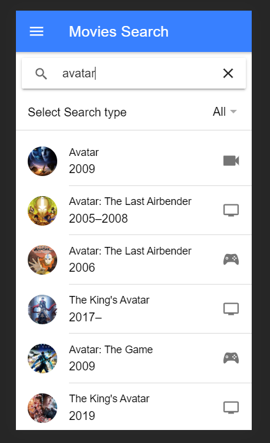
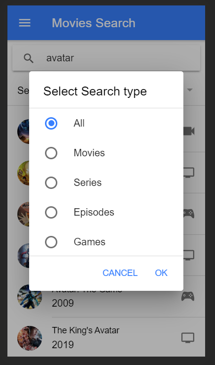
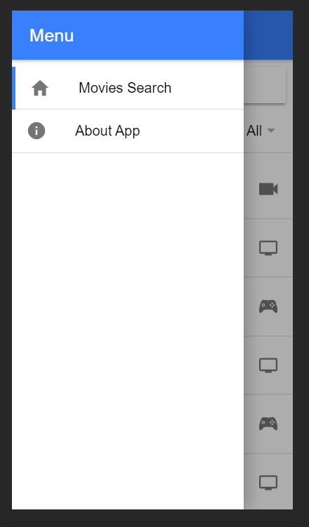
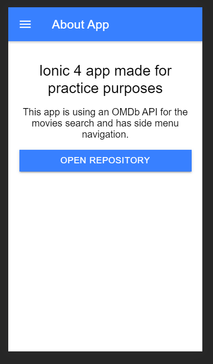
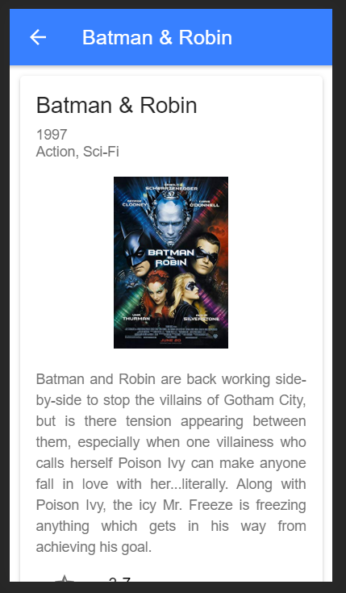
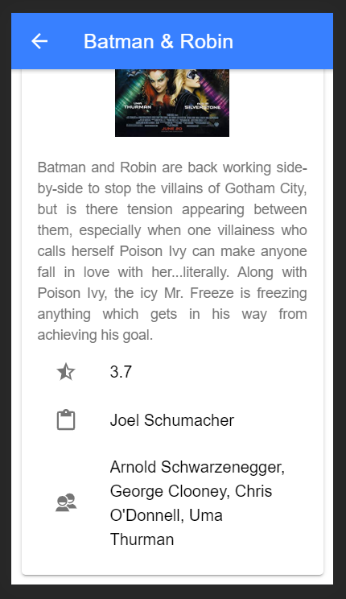

# ionic4-movieApp
Movie app using Ionic4 with a side menu navigation + OMDb API implemented (http://www.omdbapi.com/)

# Installation

1. Ionic CLI needed. Link: https://ionicframework.com/getting-started.
2. Clone the project.
3. Register for an API key on the OBDb API website http://www.omdbapi.com/apikey.aspx (it's Free).
4. When you recieved your API key set it in the project as your environment variable in the **ionic4-movieApp/src/environments/** folder:
   * You will need to create a new file <strong>environment.ts</strong>.
   * And insert following: 
<pre>
    <code>
        export const environment = {production: false}; 
        export const API_KEY = 'YOUR_API_KEY'; //here you insert your API key
    </code>
</pre>
5) Open the project's directory in the terminal and run <strong>ionic serve</strong> to run the app in your browser.

# Screenshots

  
  
  
  
  
  

  
